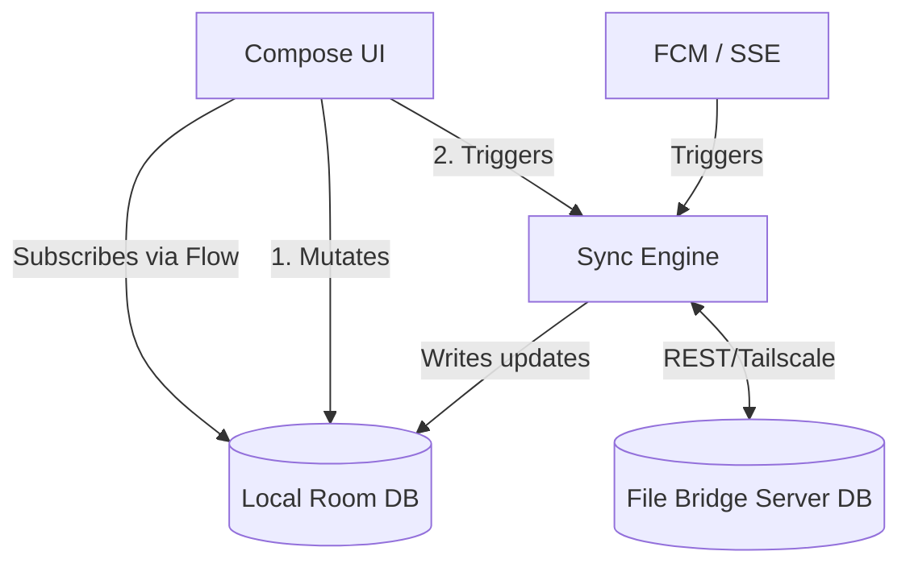

# Phase 5: Sovereign Sync (Local-First Migration Plan)

**Date:** 2026-03-12
**Author:** Gemini CLI (Engineering)
**Status:** Proposed

## The Problem: "Manual Sync"
Currently, the Dispatch app relies on a **Manual Sync** architecture. 
1. The app receives a ping via FCM or SSE.
2. The UI layer (ViewModels) manually requests the latest data from the server.
3. The UI attempts to merge the server response with its local state, leading to race conditions (C1, C2, C3, C4 bugs).
4. If the network drops, the UI cannot show thread lists or new messages reliably because it holds state in memory rather than disk.

## The Solution: "Local-First Architecture"
We will pivot to a **Local-First** model. In this paradigm, the local database (Room) is the **single source of truth**. 
- The UI *never* talks to the network. It only subscribes to the Room database via Kotlin `Flow`.
- A background **Sync Engine** is the only component that talks to the network. It quietly mirrors the File Bridge SQLite database into the Android Room database.

---

## Architecture Diagram

---

## Migration Plan: 4 Phases

### Phase 1: Database Schema Hardening (Room)
Currently, `DispatchMessage` and `MessageDao` only store a rolling cache of 100 messages mostly used for audio playback. We need to expand Room to handle the full thread list and messages.
- **Action 1:** Create `ThreadEntity` (id, subject, participant_list, last_activity, message_count).
- **Action 2:** Update `MessageEntity` to map perfectly to server-side `ThreadMessage`.
- **Action 3:** Add `sync_status` fields (`PENDING`, `SYNCED`, `FAILED`) to handle optimistic UI updates.

### Phase 2: The UI Disconnect (View to Room)
We will sever the direct link between the UI ViewModels and the Network Repositories.
- **Action 1:** `ChatViewModel` will observe `ThreadDao.getAllThreadsFlow()`.
- **Action 2:** `MessagesViewModel` will observe `MessageDao.getMessagesForThreadFlow(threadId)`.
- **Outcome:** The UI will instantly reflect whatever is in the local database. No more manual `refresh()` loops or state merging in the UI.

### Phase 3: The Sync Engine (Network to Room)
We will build a centralized `SyncManager` that handles all communication with the File Bridge.
- **Action 1:** When FCM/SSE fires, they call `SyncManager.syncThreads()`.
- **Action 2:** `SyncManager` fetches data in the background and calls `Dao.insertAll(..., OnConflictStrategy.REPLACE)`.
- **Outcome:** Room is updated silently. Because the UI is observing Room via `Flow`, the screen updates magically without race conditions.

### Phase 4: Optimistic Mutations (Writing Data)
When you type a message and hit send:
- **Action 1:** Insert message into Room immediately with `sync_status = PENDING`. (UI shows it instantly).
- **Action 2:** `SyncManager` attempts to POST to File Bridge.
- **Action 3:** On success, update Room `sync_status = SYNCED`. On failure, `FAILED` (showing a red retry icon).

---

## Execution Strategy
To avoid breaking the current working UI, we will do this surgically:
1. Start with Phase 1 & 2 on the **ChatScreen** (Thread List) first. It's the safest place to test the Sync Engine.
2. Move to the **MessagesScreen** (Thread Detail) second.
3. Finally, implement the Optimistic Mutations for replies.

**Estimated Time to Complete Phase 1 & 2:** ~1 Session.